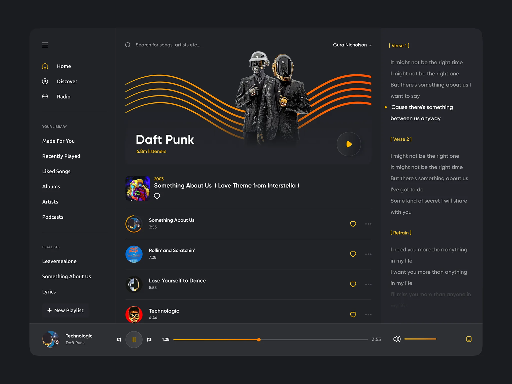

# 🎧 Spotify Clone — Dynamic Music Player

Spotify Clone — a modern music web application. It delivers an immersive listening experience where every beat, lyric, and player element is synchronized in real time. Users can explore tracks, search with filter, create custom playlists, and enjoy seamless audio playback through an elegant, developer-crafted interface. Designed for smooth performance, scalability, and a clean user experience — this project reflects the power of modern front-end engineering.

---

<h3>🖼 Preview</h3>

---

<h3>🎯 Project Goals</h3>

- ✅ Build an immersive and dynamic music streaming interface using React
- ⚡ Deliver smooth and responsive UI with TailwindCSS and SCSS modules
- 🎵 Synchronize audio playback with lyrics and player animation
- 🧠 Ensure clean, maintainable, and scalable code through TypeScript
- 🚀 Optimize performance with Vite for fast build and development speed

---

<h3>🧩 Development Features</h3>

- ⚛️ React Components Architecture — modular and reusable design
- 🧠 TypeScript — strict typing and maintainable logic
- 🎨 TailwindCSS + SCSS — hybrid styling approach for flexibility and control
- 🔊 Audio synchronization — dynamic lyric highlighting tied to track progress
- 💾 Local playlists — create and manage personalized collections
- 🌗 Adaptive UI — responsive and theme-friendly layout
- ⚙️ Vite — lightning-fast development environment and optimized builds

---

<h3>🛠️ Tech Stack</h3>

| Technology             | Purpose.                              |
| ---------------------- | ------------------------------------- |
| **React**              | Component-based UI architecture       |
| **TypeScript**         | Type safety & clean logic structure   |
| **TailwindCSS / SCSS** | Styling and layout flexibility        |
| **Vite**               | Fast build tool and dev server        |
| **HTML5 / CSS3**       | Core structure and responsive design. |

---

✨ The chosen **technology stack** ensures stable performance, ease of development, and long-term support.
